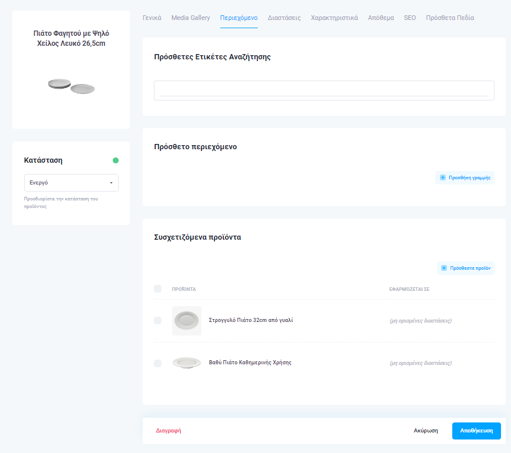

# Προϊόντα


Μεταβείτε: **Κατάλογος > Προϊόντα.**


* [x] Στη _λίστα_, αναζητήστε προϊόντα (Σε Προσχέδιο, Αρχειοθετημένο, Ενεργό) ή προβείτε σε <mark style="color:blue;">Σύνθετη Αναζήτηση</mark>, συμπληρώνοντας τα πεδία:&#x20;

<!---->

* **Μέγιστη/Ελάχιστη τιμή**, πληκτρολογώντας την επιθυμητή ή με τη βοήθεια των +/- δεξιά και αριστερά των πεδίων.&#x20;
* **Κατηγορία**
* **Επιπλέον Κατηγορίες**
* &#x20;**Κατασκευαστής**
* &#x20;**Πρότυπο Χαρακτηριστικών**
* &#x20;**Ετικέτες**
* **Χαρακτηρισμοί πηγής**&#x20;
* **Μοντέλο διαθεσιμότητας**
* **Τιμολογιακή κατηγορία Καταλόγου**
* **Έχει Media**, που φιλτράρει τα προϊόντα που έχουν εικόνες

Κάτω δεξιά, έχετε τη δυνατότητα να επιλέξετε ανά πάσα στιγμή: <mark style="color:blue;"><Καθαρισμός Φίλτρων></mark> και να συμπληρώσετε εκ νέου τα πεδία.

<figure><figcaption>
Σύνθετη Αναζήτηση
</figcaption></figure>

Στα _αποτελέσματα αναζήτησης_ θα δείτε το Όνομα κάθε προϊόντος, τον αριθμό SKU, την Κατάσταση, την Ημερομηνία Εισαγωγής και τις Ενέργειες (Εμφάνιση ή Διαγραφή).&#x20;

<figure><figcaption></figcaption></figure>

Για να διαγράψετε προϊόντα, πατήστε πάνω στο κουτάκι που βρίσκεται αριστερά από κάθε αντικείμενο ή το πρώτο κουτάκι που βρίσκεται αριστερά από το την μπάρα κατηγοριών για επιλογή όλων των προϊόντων και έπειτα το κόκκινο κουμπί <mark style="color:red;"><Διαγραφή Επιλεγμένων></mark>.

<figure><figcaption></figcaption></figure>

* [x] Ακόμη, για να εφαρμόσετε **μαζικές μεταβολές** σε προϊόντα, πατήστε πάνω στο κουτάκι που βρίσκεται αριστερά από κάθε αντικείμενο ή το πρώτο κουτάκι που βρίσκεται αριστερά από την μπάρα κατηγοριών για επιλογή όλων των αντικειμένων και ύστερα το κουμπί **<Επεξεργασία των επιλεγμένων>.**

<figure><figcaption></figcaption></figure>

Στη συνέχεια, θα μεταφερθείτε στη _φόρμα μαζικής ενημέρωσης_, όπου:

· επιλέγετε <Αλλαγή> και στη συνέχεια **<Κατάσταση>** από τη λίστα επιλογής.

· επιλέγετε <Αλλαγή> και στη συνέχεια την **<Κατηγορία>** προϊόντων που επιθυμείτε από τη λίστα επιλογής.

· επιλέγετε <Αλλαγή> και στη συνέχεια <Προσθήκη> ή <Αφαίρεση> **Πρόσθετης κατηγορίας** που θα διαλέξετε από την αντίστοιχη λίστα επιλογής.

· επιλέγετε <Αλλαγή> και στη συνέχεια, από τη λίστα επιλογής, **<Μοντέλο διάθεσης>** που αφορά το προϊόν, ώστε να φαίνονται εξατομικευμένα μηνύματα ανάλογα με τη διαθεσιμότητά του.

· επιλέγετε <Αλλαγή> και στη συνέχεια **<Τιμολογιακή Κατηγορία>** από τη λίστα επιλογής.

· επιλέγετε <Αλλαγή> και στη συνέχεια **<Πρότυπα χαρακτηριστικών>** από τη λίστα επιλογής για να προσθέσετε χαρακτηριστικά στο προϊόν ή στα προϊόντα.

· επιλέγετε <Αλλαγή> και στη συνέχεια <Προσθήκη> ή <Αφαίρεση> **Ετικέτας**, είτε υπάρχουσας, που θα διαλέξετε από τη λίστα επιλογής, είτε νέας που θα πληκτρολογήσετε στην ίδια μπάρα.

<figure><figcaption></figcaption></figure>

 

<figure><figcaption></figcaption></figure>

 

<figure><figcaption></figcaption></figure>

* [x] Για να εξαγάγετε σε αρχείο pdf τον κατάλογο προϊόντων σας, πατήστε πάνω δεξιά **\<Export>**. Επιλέγετε \<Excel> και στη συνέχεια \<Export> για να ολοκληρώσετε την ενέργειά σας. &#x20;

<figure><figcaption></figcaption></figure>

* [x] Για να προσθέσετε ένα προϊόν στην πλατφόρμα, πατήστε πάνω δεξιά το κουμπί <mark style="color:blue;"><Νέο></mark>.

Έχοντας μεταφερθεί στην καρτέλα **<Γενικά>**, μπορείτε να ορίσετε την κατάσταση του προϊόντος (Ενεργό, Σε προσχέδιο ή Αρχειοθετημένο). &#x20;

Συμπληρώστε τα _πεδία εισαγωγής_:

* **Τίτλος**, δηλαδή το όνομα του προϊόντος (υποχρεωτικός - επιλέγετε την επιθυμητή γλώσσα δεξιά)
* **Υπότιτλος** (επιλέγετε την επιθυμητή γλώσσα δεξιά)
* Μονάδα Φύλαξης Αποθεμάτων **(SKU)**
* Αριθμός ανταλλακτικού κατασκευαστή **(MPN)**
* **Περιγραφή προϊόντος**, στην οποία προσθέτετε το προϊόν


Είναι διαθέσιμο το _AI Assistant_, μια μηχανή που αναπαράγει περιεχόμενο βάσει των δεδομένων που τις δίνετε. Με τη χρήση του αυτόματα παραγόμενου περιεχομένου, μέσω της τεχνητής νοημοσύνης, μπορείτε να ολοκληρώσετε τις περιγραφές των προϊόντων σας.&#x20;


Επιλέξτε την επιθυμητή γλώσσα και ύστερα το κουμπί <Παραγωγή>. Ακριβώς από κάτω θα εμφανιστεί το παραγόμενο περιεχόμενο.&#x20;

* **Κατηγορία**
* **Πρόσθετες κατηγορίες**
* **Κατασκευαστής**
* **Μονάδα Μέτρησης**
* **Μοντέλο διάθεσης**
* **Ετικέτες**, ώστε να βρίσκουν οι πελάτες ευκολότερα το προϊόν

Ακόμη, αναφορικά με τις **Τιμές**:

* **Τιμή χονδρικής**
* **Αρχική Τιμή**
* **Προτεινόμενη τιμή λιανικής από τον κατασκευαστή (MSRP)**
* **Φ.Π.Α.**
* **Καθεστώς Μειωμένου Φ.Π.Α.**
* **Τιμολογιακή Κατηγορία**

Στην **Αποστολή**, συμπληρώστε το Βάρος, το Μήκος, το Πλάτος και το Ύψος του προϊόντος.

<figure><figcaption>
Καρτέλα &#x3C;Γενικά>
</figcaption></figure>

 

<figure><figcaption></figcaption></figure>

 

<figure><figcaption></figcaption></figure>

Στην καρτέλα **\<Media Gallery>** μπορείτε να ανεβάσετε αρχεία, πατώντας δεξιά <mark style="color:blue;"><Επιλέξτε Αρχεία></mark> ή εισαγάγοντας τον αντίστοιχο σύνδεσμο (<mark style="color:blue;"><Προσθέστε σύνδεσμο></mark>).&#x20;

Στην πρώτη περίπτωση, καλείστε να αναζητήσετε από την μπάρα αναζήτησης πάνω αριστερά, αρχεία που έχετε ανεβάσει, να εισαγάγετε νέο φάκελο, πατώντας <mark style="color:blue;"><+ Νέος φάκελος></mark> <mark style="color:blue;"></mark><mark style="color:blue;">****</mark> ή να ανεβάσετε επιπλέον αρχεία, πατώντας <mark style="color:blue;"><Ανεβάστε αρχεία></mark>. Αν επιθυμείτε να μεταφορτώσετε μεγάλο όγκο αρχείων, μπορείτε αυτό να το κάνετε τμηματικά ή να ανεβάσετε ένα Zip. Πατήστε <mark style="color:blue;"><Προσθήκη επιλεγμένων></mark> ή <Ακύρωση>.

Στη δεύτερη περίπτωση, καλείστε να ορίσετε Τίτλο, Media Type (δηλαδή αν πρόκειται να ανεβάσετε Εικόνα, Βίντεο ή Αρχείο) και το File URL. Πατήστε <mark style="color:blue;"><ΟΚ></mark> ή <Ακύρωση>.

<figure><figcaption>
Καρτέλα &#x3C;Media Gallery>
</figcaption></figure>

 

<figure><figcaption>
&#x3C;Επιλέξτε Αρχεία>
</figcaption></figure>

 

<figure><figcaption>
&#x3C;Προσθέστε σύνδεσμο>
</figcaption></figure>

Στην καρτέλα **<Περιεχόμενο>** (1), μπορείτε να προσθέσετε:

* **Πρόσθετες Ετικέτες Αναζήτησης**
* **Πρόσθετο περιεχόμενο**, πατώντας <mark style="color:blue;"><+Προσθήκη γραμμής></mark> (2). Στο νέο παράθυρο, εισαγάγετε Τίτλο και Περιγραφή (επιλέγοντας την επιθυμητή γλώσσα).
* **Συσχετιζόμενα προϊόντα**. Στο νέο παράθυρο, διαλέγετε προϊόντα του καταστήματος που σχετίζονται με το προστεθέν προϊόν (3).&#x20;

<figure><figcaption>
Καρτέλα &#x3C;Περιεχόμενο> - Παράδειγμα (1)
</figcaption></figure>

<figure><figcaption>
(2)
</figcaption></figure>

 

<figure><figcaption>
(3)
</figcaption></figure>

Στην καρτέλα **<Διαστάσεις>** μπορείτε να συμπληρώσετε τις διαστάσεις του προϊόντος.

Κάντε κλικ <mark style="color:blue;"><+ Προσθήκη Παραλλαγής></mark> και πληκτρολογήστε ή επιλέξτε αριστερά ένα από τα: _Μέγεθος, Χρώμα, Μοτίβο_ και _Υλικό_. Ορίστε τιμή στη διπλανή μπάρα και έπειτα πατήστε το πλήκτρο \<enter>. Θα σας εμφανιστεί η λίστα με τον Συνδυασμό Στοιχείων Παραλλαγής, την Τιμή που προσθέσατε και την Ποσότητα.

Στις Ενέργειες δίπλα, μπορείτε να πατήσετε <Επεξεργασία> ή <Αφαίρεση>. Στην πρώτη περίπτωση, θα μεταφερθείτε σε νέο παράθυρο, όπου έχετε τη δυνατότητα να επεξεργαστείτε την Παραλλαγή, δηλαδή να αλλάξετε Τιμή, Ποσότητα, Μονάδα Φύλαξης Αποθεμάτων (SKU) και MPN, δηλαδή Κωδικό Κατασκευαστή. Κλικάρετε για να αφαιρέσετε τις αλλαγές σας ή <mark style="color:blue;"><ΟΚ></mark> για να τις καταχωρίσετε.

<figure><figcaption>
Καρτέλα &#x3C;Διαστάσεις>
</figcaption></figure>

 

<figure><figcaption></figcaption></figure>

Στην καρτέλα **<Χαρακτηριστικά>**, μπορείτε να επιλέξετε ένα πρότυπο χαρακτηριστικών αναφορικά με το προϊόν.

<figure><figcaption>
Καρτέλα &#x3C;Χαρακτηριστικά>
</figcaption></figure>

Στην καρτέλα **<Απόθεμα>**, συμπληρώνετε τον αριθμό της Ποσότητας υπολοίπου και το Ελάχιστο όριο αποθέματος. Μπορείτε να επιλέξετε να πουλήσετε προϊόντα εκτός αποθέματος ή να διακόψετε τη λήψη παραγγελίας (<Πουλήστε προϊόντα εκτός αποθέματος> και <Διακοπή λήψης παραγγελίας>, αντίστοιχα).

<figure><figcaption>
Καρτέλα &#x3C;Απόθεμα>
</figcaption></figure>

Στην καρτέλα **\<SEO>**, συμπληρώνετε:

* **Url alias**, δηλαδή την κατάληξη του συνδέσμου που παραπέμπει στη σελίδα του προϊόντος
* **SEO Title**, στη γλώσσα που θέλετε (για αλλαγή γλώσσας πατάτε το εικονίδιο της υδρογείου δεξιά).&#x20;
* **Περιγραφή SEO**
* **Meta Title**
* **Περιγραφή Meta**
* **Meta keywords**

Για να επεξεργαστείτε τα παραπάνω δεδομένα σε ήδη υπάρχον προϊόν, πατήστε πάνω στο όνομά του ή στην επιλογή <Εμφάνιση> (Ενέργειες > Εμφάνιση) που αντιστοιχεί σε αυτό.

<figure><figcaption></figcaption></figure>


Έχετε τη δυνατότητα να ορίσετε **τίτλο SEO, Περιγραφή SEO, Meta title, Περιγραφή Meta και Meta keywords** σε ένα προϊόν με τη βοήθεια του εργαλείου AI (Τεχνητή Νοημοσύνη).&#x20;

Πατήστε <Παραγωγή> αν επιθυμείτε να σας προταθεί περιεχόμενο βασισμένο στις λέξεις-κλειδιά που θα εισαγάγετε και <Βελτιστοποίηση> για να βελτιστοποιήσετε (ήδη υπάρχον) περιεχόμενο.&#x20;

* [x] Επιλεγετε το κουμπί <Παραγωγή όλων> στην περίπτωση που επιθυμείτε να κάνετε χρήση του εργαλείου AI μαζικά.&#x20;


<figure><figcaption>
Παράδειγμα χρήσης AI (SEO Title)
</figcaption></figure>


Σε κάθε περίπτωση, μπορείτε να αποθηκεύσετε ή να ακυρώσετε τις ενέργειές σας, πατώντας <mark style="color:blue;"><Αποθήκευση></mark> ή <Ακύρωση> αντίστοιχα, αλλά και να τις διαγράψετε, πατώντας <mark style="color:red;"><Διαγραφή></mark> αριστερά.


