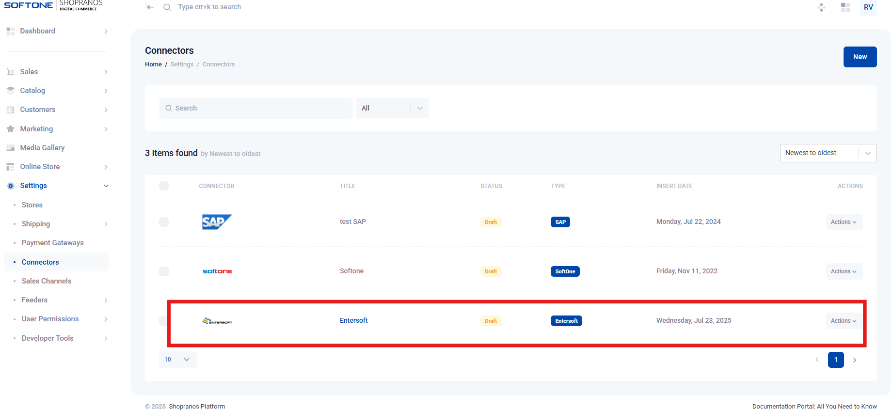

# Διασύνδεση (Connectors)

<mark style="color:yellow;">**ΔΙΑΣΥΝΔΕΣΗ ERP-SHOPRANOS**</mark>

1. **Εμφάνιση  του Web service Shopranos στο ERP**

Για τη διασύνδεση του Shopranos χρειάζεται να υπάρχει στο ERP το web service με id 955 **(Μενού στις Παραμετροποιήσεις > WEB and Mobile > Υπηρεσίες Web) και** βεβαιώνεστε πως υπάρχει στη λίστα (βλ. Εικόνα 1).

<figure><figcaption>
Εικόνα 1
</figcaption></figure>

Εάν δεν εμφανίζεται, θα πρέπει από το εικονίδιο του χρήστη στο top bar του ERP να ανοίξετε την επιλογή: **Άδειες Web and Mobile** και να προχωρήσετε σε **Ανανέωση,** ούτως ώστε να εμφανιστεί το web service 955. Σε περίπτωση που πάλι δεν είναι ορατό, θα χρειαστεί update η έκδοση του ERP (βλ. Εικόνα 2).

<figure><figcaption>
Εικόνα 2
</figcaption></figure>

2. **Δημιουργία Web account**

Από το Μενού **Παραμετροποιήσεις > WEB and Mobile > Λογαριασμοί Web** προβαίνετε σε δημιουργία νέου λογαριασμού, δηλώνοντας Υπηρεσία χρήστη, το service 955 του Shopranos, Username, Password και Email (βλ. Εικόνα 3).

<figure><figcaption>
Εικόνα 3
</figcaption></figure>

3. **Δημιουργία του Connector στο Shopranos**


Μεταβείτε: **Ρυθμίσεις > Εισαγωγή – Εξαγωγή Δεδομένων > Connectors**, για να δημιουργήσετε έναν Connector με βάση τα παραπάνω στοιχεία από το ERP (βλ. Εικόνα 4).


<figure><figcaption>
Εικόνα 4
</figcaption></figure>

Δηλώνετε το όνομα (πχ. Softone), επιλέγετε την πηγή και στο επόμενο βήμα δηλώνετε τα στοιχεία (βλ. Εικόνα 5):

* Σειριακός αριθμός (SN του ERP)
* App Id (το 955)
* Όνομα χρήστη και Κωδικός (το όνομα και τον κωδικό του web account που δημιουργήσατε στο ERP).

<figure><figcaption>
Εικόνα 5
</figcaption></figure>


Στη συνέχεια, επιλέγετε <Υποβολή> και <Αποθήκευση>.


#### <mark style="color:yellow;">Entersoft Connector for Softone Sales Suite</mark>

#### Βήμα 1: Generate Token for Sales Suite Connector

Για να δημιουργήσετε ένα token για  **Sales Suite Connector** στο **Entersoft**, ακολουθήστε τα παρακάτω βήματα:

1. **Πρόσβαση στο Cloud Store**: Μεταβείτε στο Cloud Store όπου διαχειρίζεστε τις λύσεις Entersoft.
2. **Εντοπισμός του Connector**: Βρείτε το **Sales Suite Connector** μέσα στη λίστα διαθέσιμων connectors.
3. **Δημιουργία Token**: Επιλέξτε τον Connector και πατήστε στην επιλογή για δημιουργία token. Ενδέχεται να χρειαστεί να συνδεθείτε με λογαριασμό που έχει κατάλληλα δικαιώματα.
4. **Αντιγραφή Token**: Μετά τη δημιουργία, αντιγράψτε το token και αποθηκεύστε το με ασφάλεια. Το token αυτό θα χρησιμοποιηθεί για την ολοκλήρωση της σύνδεσης μεταξύ των συστημάτων.

Μετά την ολοκλήρωση αυτών των βημάτων, μπορείτε να προχωρήσετε με τη σύνδεση και την ενσωμάτωση των συστημάτων σας χρησιμοποιώντας το παραγόμενο token.

<figure><figcaption></figcaption></figure>

**Βήμα 2: Προσθήκη χρηστών (backoffice user)**

<figure><figcaption></figcaption></figure>

#### Βήμα 3: Προσθήκη Σύνδεσης

Κατά τη διαδικασία προσθήκης μιας νέας σύνδεσης, είναι σημαντικό να εισάγετε τις παρακάτω πληροφορίες με ακρίβεια:

* **Database ID**: Ο μοναδικός αριθμός αναγνώρισης της βάσης δεδομένων.
* **Εταιρεία**: Το όνομα της εταιρείας στην οποία ανήκει η βάση δεδομένων.
* **Branch ID**: Ο αριθμός ταυτότητας του υποκαταστήματος.
* **Server IP/Public + Port**: Η δημόσια IP του διακομιστή και η θύρα που χρησιμοποιείται για τη σύνδεση.
* **GRPC Remote**: Η διεύθυνση GRPC για απομακρυσμένη σύνδεση.
* **EBS User (backoffice) & Password**: Ονοματεπώνυμο και κωδικός πρόσβασης του χρήστη backoffice. Ο κωδικός πρέπει να πληροί συγκεκριμένους κανόνες ασφαλείας.
* **Subscription ID**: Το μοναδικό ID της συνδρομής.
* **Subscription Password (cloud infra)**: Ο κωδικός της συνδρομής που δημιουργήθηκε από τον υπεύθυνο για τη δημιουργία της.

<figure><figcaption></figcaption></figure>

η γέφυρα είναι έτοιμη.

**Βήμα 4: integrations / add endpoint**

<figure><figcaption></figcaption></figure>

Ρύθμιση της Γέφυρας (Bridge) για τον Sales Suite Connector

1. **User ID / Κωδικός Πρόσβασης**: Βεβαιωθείτε ότι διαθέτετε τα σωστά διαπιστευτήρια χρήστη EBS για πρόσβαση.
2. **Ρύθμιση Γέφυρας**: Συμβουλευτείτε την προηγούμενη ρύθμιση της γέφυρας ώστε να διατηρηθεί η συνέπεια στη διαμόρφωση.
3. **Επιλογή Υποκαταστήματος**: Επιλέξτε το κατάλληλο υποκατάστημα που θα χρησιμοποιηθεί για την ενσωμάτωση.
4. **Δικαιώματα Πρόσβασης**: Πατήστε **«Επίτρεψε» (Allow)** για να παραχωρηθούν τα απαραίτητα δικαιώματα πρόσβασης.

<figure><figcaption></figcaption></figure>

#### Βήμα 5: Απόκτηση Token

<figure><figcaption></figcaption></figure>

**Βήμα 6: Shopranos Connector**

1. Μεταβείτε στην ενότητα Shopranos -> Connector -> Προσθήκη Token.
2. Δημιουργήστε το certificate.
3. Κατεβάστε το αρχείο Datapump.
4. Στο certificate -> επικολλήστε το certificate από τον server.
5. Εγκαταστήστε το αρχείο Datapump στον ERP server.

**Βήμα 7: Connector Configuration**

<figure><figcaption></figcaption></figure>

<figure><figcaption></figcaption></figure>

Στις ρυθμίσεις του connector Entersoft ERP μπορείτε να ορίσετε τις βασικές ρυθμίσεις της διασύνδεσης με το Shopranos.&#x20;

1. Ρυθμίσεις καταλόγου
2. Ρυθμίσεις πελατών
3. Ρυθμίσεις Αποθήκης
4. Ρυθμίσεις Παραγγελιών
5. Ρυθμίσεις τιμών
6. Ρυθμίσεις Datapump
