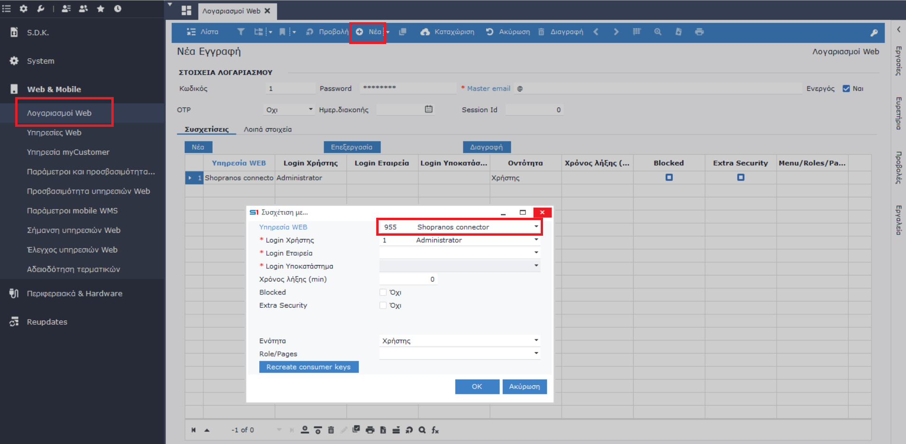

# Connectors

<mark style="color:yellow;">**ΔΙΑΣΥΝΔΕΣΗ ERP-SHOPRANOS**</mark>

1. **Εμφάνιση  του Web service Shopranos στο ERP.**

Για τη διασύνδεση του Shopranos χρειάζεται να υπάρχει στο ERP το web service με id 955 **(Μενού στις Παραμετροποιήσεις > WEB and Mobile > Υπηρεσίες Web) και** βεβαιώνεστε πως υπάρχει στη λίστα (βλ. Εικόνα 1).

<figure><figcaption>
Εικόνα 1
</figcaption></figure>

Εάν δεν εμφανίζεται, θα πρέπει από το εικονίδιο του χρήστη στο top bar του ERP να ανοίξετε την επιλογή: **Άδειες Web and Mobile** και να προχωρήσετε σε **Ανανέωση** ούτως ώστε να εμφανιστεί το web service 955. Σε περίπτωση που πάλι δεν είναι ορατό, θα χρειαστεί update η έκδοση του ERP (βλ. Εικόνα 2).

<figure><figcaption>
Εικόνα 2
</figcaption></figure>

2. **Δημιουργία Web account**

Από το Μενού **Παραμετροποιήσεις > WEB and Mobile > Λογαριασμοί Web** προβαίνετε σε δημιουργία νέου λογαριασμού, δηλώνοντας Υπηρεσία χρήστη, το service 955 του Shopranos, Username, Password και Email (βλ. Εικόνα 3)

<figure><figcaption>
Εικόνα 3
</figcaption></figure>

3. **Δημιουργία του Connector στο Shopranos**


Μεταβείτε: **Ρυθμίσεις > Εισαγωγή – Εξαγωγή Δεδομένων > Connectors**, για να δημιουργήσετε έναν Connector με βάση τα παραπάνω στοιχεία από το ERP (βλ. Εικόνα 4).


<figure><figcaption>
Εικόνα 4
</figcaption></figure>

Δηλώνετε το όνομα πχ. Softone, επιλέγετε την πηγή και στο επόμενο βήμα δηλώνετε τα στοιχεία (βλ. Εικόνα 5):

* Σειριακός αριθμός (SN του ERP)
* App Id (το 955)
* Όνομα χρήστη και Κωδικός (το όνομα και ο κωδικός του web account που δημιουργήσατε στο ERP).


Στη συνέχεια, επιλέγετε <Υποβολή> και <Αποθήκευση>.


<figure><figcaption>
Εικόνα 5
</figcaption></figure>
